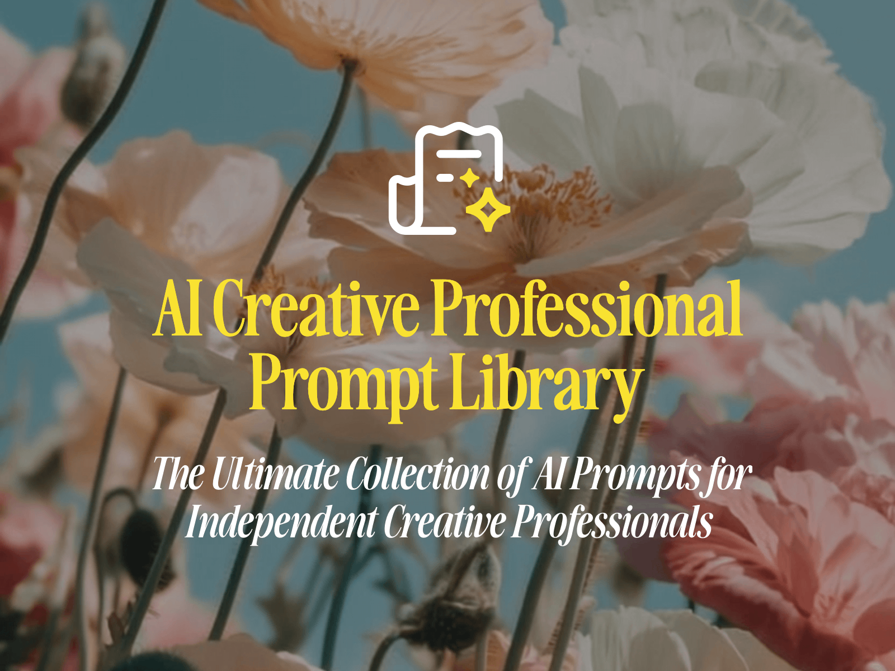

# Independent AI Creative Professional

Hey there! 👋 Welcome to my collection of resources for AI-enhanced creative work. This repo contains my evolving toolkit for navigating the world where human creativity meets AI assistance.

## What's This All About?

I'm Shaun Duval, an independent creative professional who uses AI tools like Midjourney, Higgsfield, and Runway to create digital art, develop brand identities, and help clients with creative projects. This repository is where I organize my prompt libraries, workflows, and other resources that help me deliver high-quality creative work.

Think of this as my creative workshop - except instead of paintbrushes and pencils on the walls, I've got prompt techniques and creative workflows hanging up for easy access.

## Why I Created This Repo

As AI tools have transformed creative work since 2022, I've been documenting what works, what doesn't, and how to find the sweet spot between human creativity and AI assistance. After building up a collection of useful prompts and workflows in Notion, I decided to:

1. **Organize everything in one place** - so I can find what I need quickly
2. **Version control my approaches** - to track how my techniques evolve
3. **Share knowledge with other creatives** - because we're all figuring this out together
4. **Document my unique creative process** - to maintain consistency across projects

## What You'll Find Here

### 📚 Prompt Library
A comprehensive collection of prompts for different creative tasks, organized by purpose:
- Concept development prompts for brainstorming and ideation
- Style refinement techniques for consistent visual language
- Client collaboration templates for effective communication
- Quality enhancement prompts for polishing and finalizing work

### 💼 Business Resources
Templates and frameworks for the business side of AI creative work:
- Service tier descriptions and pricing strategies
- Client onboarding materials and questionnaires
- Transparent explanations of my AI process for clients
- Case study templates and marketing materials

### 🔄 Workflows
Step-by-step guides for different creative processes:
- Digital art creation workflows
- Brand identity development processes
- Concept development approaches
- Video and motion graphics production

### 🛠️ Tool-Specific Resources
Techniques and tips for specific AI tools:
- Midjourney prompt techniques and pattern library
- Higgsfield workflows and approaches
- Runway video generation guides
- Claude AI prompt frameworks

### 📊 Project Case Studies
(Coming soon) Examples of successful projects with detailed breakdowns of:
- The creative brief and challenge
- AI tools and prompts used
- Human refinement techniques applied
- Final outcomes and client feedback

## How to Navigate This Repo

If you're here for the first time, start with:

1. **Prompt Library README** - for an overview of my prompt engineering approach
2. **Workflows Directory** - to understand my creative process from start to finish
3. **Business Resources** - to see how I structure and communicate my services

Each section has its own README with more detailed information.

## My Creative Approach

I believe in finding the perfect balance between human creativity and AI assistance. My approach is built on these principles:

1. **Human-directed creativity, AI-powered execution** - I guide the creative direction while using AI to explore possibilities and handle technical execution
2. **Value migration from execution to direction** - I focus on strategic direction and quality control rather than manual execution of every element
3. **Transparency with clients** - I'm always clear about which parts of a project involve AI and which involve human craftsmanship
4. **Continuous learning** - I regularly experiment with new tools and techniques to keep improving my craft

## Contributing

Have suggestions or want to collaborate? I'm open to:
- Prompt improvement ideas
- Workflow optimizations
- Business model insights
- Tool-specific techniques

Just open an issue or submit a pull request!

## Stay Connected

- Portfolio: [Personal portfolio site - coming soon]
- Instagram: [@shaunduval](https://instagram.com/@shaunduval)
- Twitter/X: [@shaunduval](https://twitter.com/@shaunduval)
- Email: [hello@shaunduval.com](mailto:hello@shaunduval.com)

---

*Last updated: May 9, 2025*
